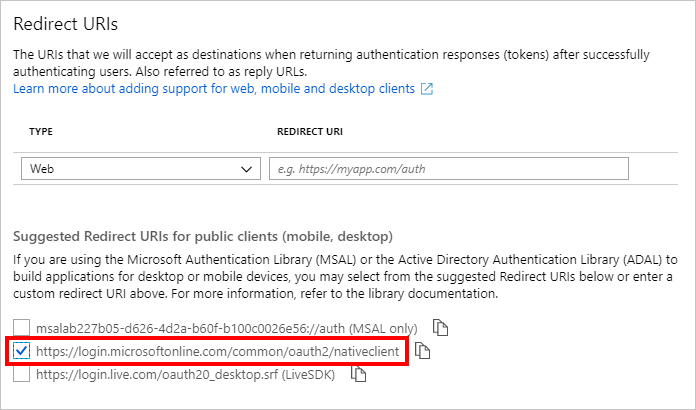

# Microsoft Graph delta query sample

This console application demonstrates how to make [delta queries](https://docs.microsoft.com/graph/delta-query-overview) to Microsoft Graph, allowing applications to request only changed entities within a target resource. This sample monitors changes to the mail folders in a user's mailbox.

## How To Run This Sample

To run this sample you will need:

- The [.NET Core 3.1 SDK](https://dotnet.microsoft.com/download)
- A user in a Microsoft 365 tenant with an Exchange Online mailbox.

### Step 1: Register the sample application in Azure Active Directory

Before running the sample, you will need to create an app registration in Azure Active Directory to obtain an application ID. You can do this with the PowerShell script in this sample, or you can register it manually in the Azure Active Directory portal.

#### Option 1: Register with PowerShell

The [RegisterApp.ps1](RegisterApp.ps1) script uses the [Azure AD PowerShell for Graph module](https://docs.microsoft.com/powershell/azure/active-directory/install-adv2?view=azureadps-2.0) to create the app registration.

1. Open Windows PowerShell in the root directory of this sample.

1. If you do not have the Azure AD PowerShell module installed, run the following command to install it:

    ```PowerShell
    Install-Module AzureAD
    ```

1. Run the following command to set the execution policy for the current PowerShell window to allow the script to run.

    ```PowerShell
    Set-ExecutionPolicy -ExecutionPolicy RemoteSigned -Scope Process
    ```

1. Run the script with the following command.

    ```PowerShell
    ./RegisterApp.ps1
    ```

1. In the pop-up window, sign in using a Microsoft 365 user that has permission to register an application in Azure Active Directory.

1. The application ID is printed to the console.

    ```PowerShell
    App creation successful. Your app ID is: b730d25e-c81c-4046-a49c-ac56c07e930a
    ```

#### Option 2: Register with the Azure Active Directory admin center

1. Open a browser and navigate to the [Azure Active Directory admin center](https://aad.portal.azure.com) and login using a Microsoft 365 user that has permission to register an application in Azure Active Directory.

1. Select **Azure Active Directory** in the left-hand navigation, then select **App registrations** under **Manage**.

    

1. Select **New registration**. On the **Register an application** page, set the values as follows.

    - Set **Name** to `Delta Query Console Sample`.
    - Set **Supported account types** to **Accounts in any organizational directory and personal Microsoft accounts**.
    - Leave **Redirect URI** empty.

    

1. Select **Register**. On the **Delta Query Console Sample** page, copy the value of the **Application (client) ID** and save it, you will need it in the next step.

    

1. Select the **Add a Redirect URI** link. On the **Redirect URIs** page, locate the **Suggested Redirect URIs for public clients (mobile, desktop)** section. Select the `https://login.microsoftonline.com/common/oauth2/nativeclient` URI.

    

1. Locate the **Default client type** section and change the **Treat application as a public client** toggle to **Yes**, then choose **Save**.

    

### Step 2: Configure the sample

1. Open your command-line interface (CLI) in the directory that contains **DeltaQuery.csproj**.

1. Run the following command.

    ```Shell
    dotnet user-secrets init
    ```

1. Run the following command to store your application ID (obtained in the previous step) to the secret manager Be sure to replace `YOUR_APP_ID` with your application ID.

    ```Shell
    dotnet user-secrets set AzureAppId YOUR_APP_ID
    ```

### Step 3: Run the sample

When the sample runs, it will prompt you to browse to a login URL and enter a device code. Once signed in, the app will check for changes to the mail folders in the user's mailbox every 30 seconds.

#### Option 1: Using Visual Studio Code

1. Open the root folder of this sample using Visual Studio Code.

1. On the **Debug** menu, choose **Start Debugging**.

#### Option 2: From the command line

1. Open your command-line interface (CLI) in the directory that contains **DeltaQuery.csproj**.

1. Run the following command to build the sample.

    ```Shell
    dotnet build
    ```

1. Run the following command to run the sample.

    ```Shell
    dotnet run
    ```

## Contributing

If you'd like to contribute to this sample, see [CONTRIBUTING.MD](/CONTRIBUTING.md).

This project has adopted the [Microsoft Open Source Code of Conduct](https://opensource.microsoft.com/codeofconduct/). For more information see the [Code of Conduct FAQ](https://opensource.microsoft.com/codeofconduct/faq/) or contact [opencode@microsoft.com](mailto:opencode@microsoft.com) with any additional questions or comments.

Copyright (c) 2020 Microsoft Corporation. All rights reserved.
